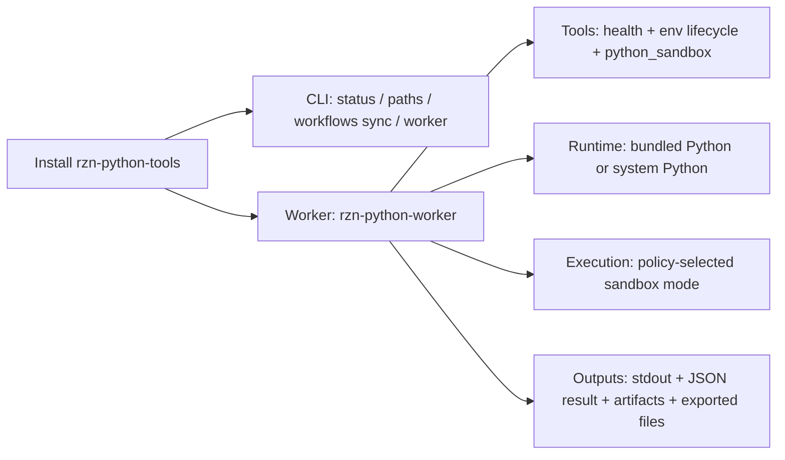
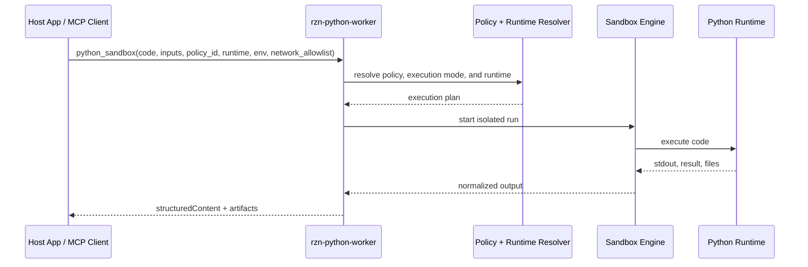
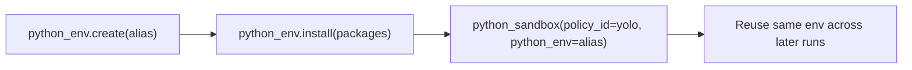

# RZN Python Sandbox

`rzn-python-sandbox` gives you an installable Python runtime for RZN-style tool workflows and a Rust library for embedding the same sandbox in your own app.

The hardening story is blunt: `balanced`, `data_science`, and `document_processing` default to `workspace_isolated`; `enterprise` requires `platform_sandboxed` and now fails closed when that OS-level boundary is unavailable; `yolo` is the app-managed env lane. macOS plugin bundles are still the strongest OS-hardened packaging path today, and there is no cross-platform App Sandbox parity claim here.

Install it and you get:

- `rzn-python-tools`: a local CLI for status, paths, workflow sync, and worker launch
- `rzn-python-worker`: an MCP worker that exposes Python execution and env management tools
- `python_sandbox`: a tool that runs Python with policy, runtime, timeout, and network controls
- optional bundled Python, so you do not have to depend on whatever the host machine happens to have
- app-scoped managed virtual environments for YOLO flows
- ready-made quick starts for stats, business logic, charts, ML, and public-data fetches

## Why this exists

If your product needs Python, the annoying part is rarely `python`. It is the rest:

- picking a runtime
- keeping dependencies under control
- deciding what the code is allowed to do
- returning JSON and files in a shape the host can actually use
- making the install story sane

This repo exists to handle that once instead of rebuilding it in every host app.

Try it if you need Python for transforms, analysis, charting, or ML, but you do not want to hand your app a raw interpreter and hope for the best.

## What You Get

| Piece | What it does |
| --- | --- |
| `rzn-python-tools` | Shows install state, resolves paths, syncs packaged workflows, and launches the worker |
| `rzn-python-worker` | Exposes health checks, managed env lifecycle tools, and `python_sandbox` over MCP stdio |
| `python_sandbox` | Executes Python with JSON `inputs`, returns `stdout`, structured `result`, and artifacts |
| Managed env tools | `python_env.list`, `python_env.create`, and `python_env.install` for app-scoped virtualenvs |
| Quick starts | Copy-pasteable workflow payloads in [`examples/python_sandbox/quick_starts`](examples/python_sandbox/quick_starts/) |

## Install

### Fastest local install

```bash
make install
rzn-python-tools status
rzn-python-tools workflows sync --force
```

That installs:

- `~/.local/bin/rzn-python-tools`
- `~/.local/bin/rzn-python-worker`
- bundled examples and quick starts under `~/.rzn/python-tools/workflows`

### Install from a GitHub release

The public repo is still [`srv1n/pysandbox-rs`](https://github.com/srv1n/pysandbox-rs), so release assets live there.

```bash
curl -fsSL https://raw.githubusercontent.com/srv1n/pysandbox-rs/main/scripts/install_rzn_python_tools.sh | \
  sh -s -- --version <version> --github-repo srv1n/pysandbox-rs --variant system
```

```powershell
powershell -ExecutionPolicy Bypass -File .\scripts\install_rzn_python_tools.ps1 -Version <version> -GitHubRepo srv1n/pysandbox-rs
```

### Pick the right variant

| Variant | Use it when |
| --- | --- |
| `system` | You want the smallest install and trust the machine's Python |
| `minimal` | You want a bundled Python runtime without the data-science stack |
| `ds` | You want bundled Python plus NumPy, Pandas, Matplotlib, and scikit-learn demos |

## How It Works

1. A host app or local operator launches `rzn-python-worker`.
2. The caller sends Python `code`, JSON `inputs`, a `policy_id`, and optional runtime/env/network settings.
3. The worker picks a Python runtime and execution mode.
4. The run returns normalized output: `stdout`, structured JSON, and optional artifacts or exported files.

The default policy mapping today is simple:

| Policy | Default execution behavior |
| --- | --- |
| `balanced` | Workspace-isolated execution |
| `enterprise` | Platform-sandboxed execution, failing closed if the OS boundary is unavailable |
| `data_science` | Worker-enforced workspace isolation with DS-friendly policy |
| `document_processing` | Worker-enforced workspace isolation |
| `yolo` | System Python, intended for managed env workflows |

The runtime choice is also explicit:

- `auto`: let the worker decide
- `bundled`: use the packaged Python runtime
- `system`: use a host Python install

`workspace_isolated` is the broadly available secure lane this repo ships today. `platform_sandboxed` is now a stricter lane for `enterprise`, but only on hosts that can actually provide the OS boundary; otherwise the run errors instead of silently downgrading.

## Example Flows

### 1. Health check the worker

Use this first. If this fails, nothing else matters.

- Tool: `rzn.worker.health`
- Quick start: [`examples/python_sandbox/quick_starts/health_probe.json`](examples/python_sandbox/quick_starts/health_probe.json)
- Result: `ok`, worker name, version, and plugin directory

### 2. Run a deterministic JSON transform

This is the smallest useful proof that the contract works.

```json
{
  "code": "numbers = inputs['numbers']\nmean = sum(numbers) / len(numbers)\nresult = {'count': len(numbers), 'mean': round(mean, 2)}",
  "inputs": {
    "numbers": [12, 19, 7, 25, 14, 22]
  },
  "policy_id": "balanced"
}
```

Expected result:

```json
{
  "count": 6,
  "mean": 16.5
}
```

### 3. Create a managed env and reuse it

This is the app-managed Python path for less restricted workflows.

1. `python_env.create` with `{"alias": "demo"}`
2. `python_env.install` with `{"alias": "demo", "packages": ["requests==2.32.3"]}`
3. `python_sandbox` with `{"policy_id": "yolo", "python_env": "demo", ...}`

Use this when you need package installs without mutating the bundled runtime.

### 4. Generate artifacts, not just JSON

The DS quick starts prove the worker can return binary outputs cleanly.

| Flow | Best variant | Quick start | Proof |
| --- | --- | --- | --- |
| Basic stats | `python-tools` | [`run_basic_stats.json`](examples/python_sandbox/quick_starts/run_basic_stats.json) | deterministic JSON result |
| Order summary | `python-tools` | [`run_order_summary.json`](examples/python_sandbox/quick_starts/run_order_summary.json) | business-style grouping and ranking |
| Synthetic chart | `python-tools-ds` | [`run_ds_plot_synthetic_orders.json`](examples/python_sandbox/quick_starts/run_ds_plot_synthetic_orders.json) | PNG artifact bundle |
| Iris classifier | `python-tools-ds` | [`run_ds_iris_classifier.json`](examples/python_sandbox/quick_starts/run_ds_iris_classifier.json) | real ML libraries inside the sandbox |
| USGS chart | `python-tools-ds` | [`run_ds_usgs_quakes_chart.json`](examples/python_sandbox/quick_starts/run_ds_usgs_quakes_chart.json) | outbound fetch behind an allowlist |

## System Integrations

| Integration point | What this repo gives you |
| --- | --- |
| RZN desktop / any MCP host | A worker process you can install, launch, and call as tools |
| Local machine install | A CLI plus a wrapped worker binary that can run outside the host app |
| Rust application | A crate that exposes `create_default_sandbox()` and related builders |
| Plugin distribution | Signed macOS plugin ZIPs plus shell-installable release bundles |

### Rust embedding

If you are embedding this in a Rust app instead of installing the worker:

```toml
[dependencies]
rzn_python_sandbox = { package = "rzn-python-sandbox", path = "path/to/rzn-python-sandbox" }
tokio = { version = "1.42", features = ["full"] }
```

```rust
use rzn_python_sandbox::{create_default_sandbox, ExecutionOptions};

let sandbox = create_default_sandbox().await?;
let result = sandbox
    .execute("result = {'ok': True}", serde_json::json!({}), ExecutionOptions::default())
    .await?;
```

## Diagram Briefs

These are source briefs for the downstream design/render team. Keep the labels literal. The point is clarity, not decoration.

### Diagram 1: Product Surface

Use this to explain what the user gets after install.



### Diagram 2: Request Lifecycle

Use this to explain a single `python_sandbox` call from request to result.



### Diagram 3: Managed Env Lifecycle

Use this to explain the less restricted package-install flow.



## More Docs

- [Quick Start Guide](QUICKSTART.md)
- [Python Tools demo ladder](docs/PYTHON_TOOLS_DEMOS.md)
- [Python Tools extension runbook](docs/PYTHON_TOOLS_EXTENSION_RUNBOOK.md)
- [Release flow](docs/RELEASE_FLOW.md)
- [Embedding guide](EMBEDDING_GUIDE.md)
- [Microsandbox guide](MICROSANDBOX_GUIDE.md)
- [Rename notes](docs/RENAME_TO_RZN_PYTHON_SANDBOX.md)

## Platform Notes

| Surface | Status |
| --- | --- |
| macOS plugin ZIPs | Supported and codesignable; this is the strongest OS-hardened path |
| macOS/Linux local install bundles | Supported |
| Windows local install bundles | `system` variant only |
| Worker secure lanes | `workspace_isolated` broadly, `platform_sandboxed` for `enterprise` on supported hosts |
| Cross-platform OS sandbox parity | Not claimed yet |

Microsandbox support is optional and documented separately in [MICROSANDBOX_GUIDE.md](MICROSANDBOX_GUIDE.md)

## License

This project is licensed under the GNU Affero General Public License v3.0.
See [LICENSE](LICENSE) for the full text.
