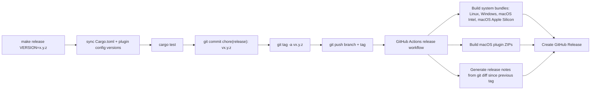

# Release Flow

Public releases are driven by one command:

```bash
make release VERSION=0.2.3
```

That command is intentionally narrow. It syncs the repo version, runs tests, creates an annotated
`v0.2.3` tag, and pushes it. GitHub Actions does the expensive part.

## Pipeline



## What Ships

| Asset class | Platforms | Notes |
| --- | --- | --- |
| System install bundles | `linux_x86_64`, `windows_x86_64`, `macos_x86_64`, `macos_aarch64` | Public GitHub release artifacts for `rzn-python-tools` + `rzn-python-worker` |
| macOS plugin ZIPs | `macos_x86_64`, `macos_aarch64` | For `rznapp` install-from-file flows |
| Install scripts | shell + PowerShell | Attached to the GitHub Release and kept in `scripts/` |
| Release notes | GitHub Release body | Generated from the git diff since the previous tag |

## Why It Works This Way

- `make release` should not locally build four operating systems. That would be dumb and fragile.
- GitHub runners already give us the native platforms we need, including separate Intel and Apple
  Silicon macOS jobs.
- Release notes are written from actual git history. No fake changelog theater.

## LLM Notes

The release notes generator uses `OPENAI_API_KEY` when it is present and falls back to a deterministic
git-summary template when it is not. That keeps releases moving while still using an LLM when the repo
is configured for it.

## Secrets

| Secret | Required | Purpose |
| --- | --- | --- |
| `OPENAI_API_KEY` | Optional | Turns on LLM-written release notes |
| `GITHUB_TOKEN` | Built-in | Creates and updates the GitHub Release |

## Local Build Commands

Use these when you want artifacts without tagging a public release:

```bash
make release-artifacts
make release-installers INSTALL_VARIANT=system
make release-plugins
```
